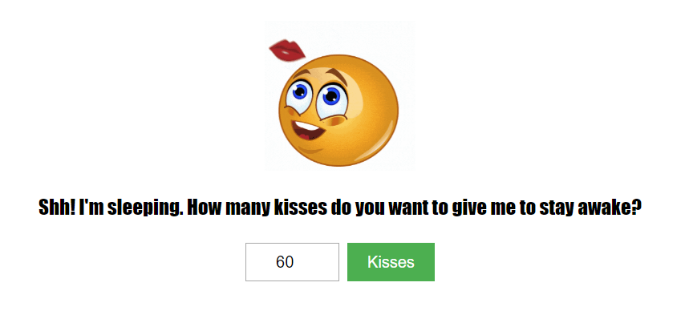

# GiveMeAKiss
Fun little project for my daughter using a simple JS function to display a different type of Emoji base on the result of a number input

### Screenshot

## Technology

- HTML5
- CSS3
- JavaScript

## Contact / Social Media

- Twitter – [@seetechnologic](https://twitter.com/seetechnologic)
- GitHub - [https://github.com/JavaVista/](https://github.com/JavaVista/)
- LinkedIn - [Javier Carrion](https://www.linkedin.com/in/technologic)

### License

Distributed under the MIT License. Note: Copyright and license text of third party modules are included in their source code.

See the 
for more information.